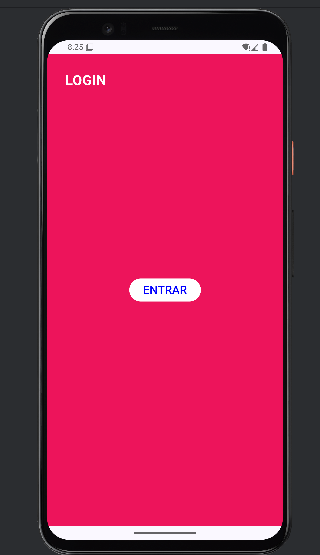
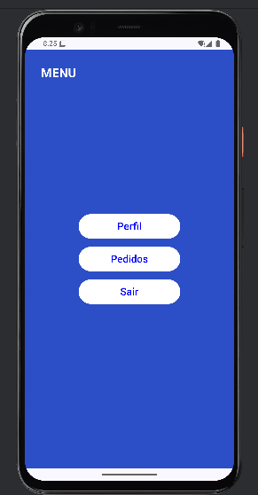
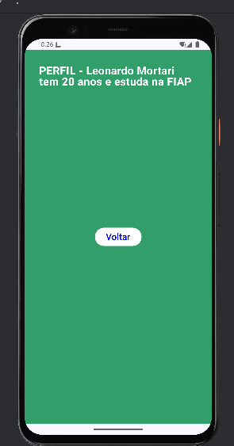
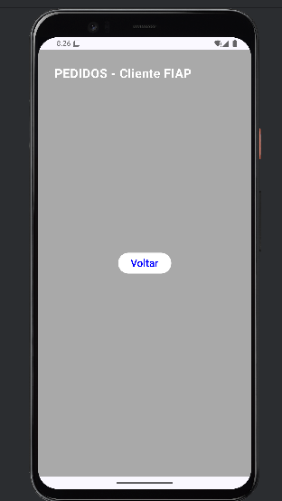

# Documentação do Projeto

## Objetivo

O projeto foi feito para demonstrar a navegação entre telas em um aplicativo simples, com envio de informações de uma tela para outra.

---

## Funcionamento Geral

O app começa na tela de login. Após entrar, o usuário vai para um menu principal, onde pode escolher entre acessar o perfil, ver pedidos ou sair.

* **Login → Menu**
* **Menu → Perfil**
* **Menu → Pedidos**
* **Menu → Login (sair)**

---

## Navegação entre Telas

A navegação é feita através de rotas, onde cada tela possui um caminho definido.

Quando o usuário clica em um botão, ele é redirecionado para outra tela usando esse caminho.

Algumas rotas recebem dados diretamente no caminho, enquanto outras utilizam parâmetros opcionais.

---

## Envio e Recebimento de Parâmetros

Os dados são enviados no momento da navegação entre telas.

### Perfil

Recebe:

* Nome
* Idade
* Faculdade

Esses dados são enviados junto com a rota ao sair do menu e depois são recuperados na tela de perfil para exibição.

### Pedidos

Recebe:

* Nome do cliente

Esse dado é enviado como parâmetro opcional. Caso não seja informado, o sistema utiliza um valor padrão.

---

## Telas

### Login

Tela inicial que permite entrar no sistema.  

### Menu

Tela principal com botões de navegação.  

### Perfil

Mostra os dados recebidos do usuário.  

### Pedidos

Mostra o nome do cliente recebido.  

---

## Observações

* As rotas precisam estar corretas para a navegação funcionar.
* Os dados enviados devem bater com o que a tela espera.
* Se algum dado não for passado corretamente, pode dar erro.

---

## Conclusão

O projeto atende ao objetivo de demonstrar navegação entre telas e envio de dados, com um fluxo simples e funcional.